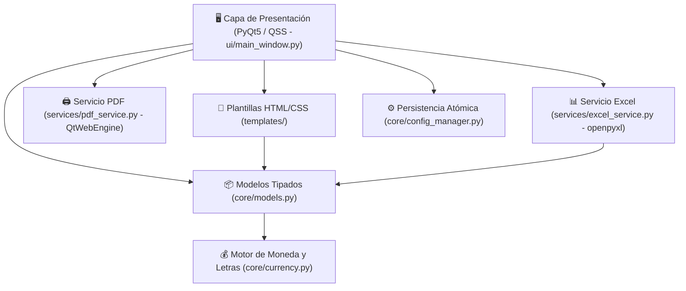

# 💼 Generador Profesional de Cotizaciones y Cuentas de Cobro TI

> **Autor:** Owen Badel Hooker — Ingeniero de Sistemas / Software Architect  
> **Versión:** 2.0.0 — Arquitectura Limpia & Modular  
> **Licencia:** Propietaria / Confidencial  

---

## 🎯 Descripción General
**Generador Profesional de Cotizaciones y Cuentas de Cobro TI** es una aplicación de escritorio de grado corporativo desarrollada en **Python** y **PyQt5**. Diseñada específicamente para ingenieros de sistemas, consultores tecnológicos y contratistas de servicios de infraestructura, automatiza la liquidación, confección y exportación de:

1. **Propuestas Técnicas y Comerciales (Cotizaciones TI):** Presentación formal de servicios, objetivos contractuales, viñetas detalladas, términos y condiciones de pago y tabla de costos.
2. **Cuentas de Cobro Oficiales:** Formato estándar nacional con numeración consecutiva autoincremental, especificación contractual, período de ejecución, datos bancarios para transferencia, declaración juramentada de no sujeción a IVA (Art. 437 del Estatuto Tributario), firma digitalizada en Base64 y monto en letras en pesos colombianos ("PESOS M/CTE").
3. **Exportación Corporativa a Excel (.xlsx):** Generación automática de libros de cálculo con diseño ejecutivo en azul marino, formato monetario contable y fórmulas de suma integradas mediante `openpyxl`.

---

## 🏛️ Arquitectura Desacoplada (Cero Código Espagueti)

El sistema implementa **Clean Architecture**, eliminando los archivos monolíticos y separando estrictamente la presentación de la lógica de negocio:



### Estructura de Directorios
```
Cotizaciones Generator/
├── config.json                     # Configuración persistente del emisor y cliente
├── firma.png                       # Firma digitalizada para documentos oficiales
├── requirements.txt                # Dependencias Python
├── AGENTS.md                       # Directiva agéntica y de gobernanza
├── README.md                       # Documentación técnica
├── main.py                         # Punto de entrada principal
├── app.py                          # Lanzador de retrocompatibilidad
├── core/                           # Lógica central del dominio
│   ├── __init__.py
│   ├── models.py                   # Dataclasses para ítems, cotizaciones y cobros
│   ├── currency.py                 # Algoritmo de números a letras y formato monetario
│   ├── config_manager.py           # Guardado seguro con reemplazo atómico
│   └── utils.py                    # Sanitización de rutas y autoincremento
├── templates/                      # Maquetación de documentos
│   ├── __init__.py
│   ├── cotizacion_template.py      # Plantilla HTML/CSS de Cotización
│   └── cuenta_cobro_template.py    # Plantilla HTML/CSS de Cuenta de Cobro
├── services/                       # Servicios de infraestructura
│   ├── __init__.py
│   ├── pdf_service.py              # Renderizado vectorial asíncrono a PDF A4
│   └── excel_service.py            # Generación de hojas de cálculo .xlsx
├── ui/                             # Interfaz gráfica
│   ├── __init__.py
│   ├── main_window.py              # Controlador de ventana principal
│   └── styles.py                   # Tema y tokens QSS
└── tests/                          # Suite automatizada de pruebas unitarias
    ├── __init__.py
    ├── test_currency.py            # Validación de conversión monetaria
    └── test_models.py              # Validación de modelos y Excel
```

---

## 🚀 Puesta en Marcha

### Prerrequisitos
- **Python 3.10+** (Recomendado Python 3.11 o 3.12).
- Dependencias indicadas en `requirements.txt`.

### Instalación y Ejecución
```bash
# 1. Instalar dependencias
pip install -r requirements.txt

# 2. Ejecutar la suite
python main.py

# 3. Ejecutar pruebas unitarias
python -m unittest discover -s tests -v
```

---

## 🔒 Buenas Prácticas y Resiliencia
- **Escritura Atómica:** Los datos de configuración se escriben en archivos temporales antes de ser reemplazados en `config.json`, evitando la pérdida de información en caso de cierre forzoso o corte de energía.
- **Escape Seguro de Caracteres:** Todo texto ingresado por el usuario es sanitizado contra inyección HTML en las plantillas.
- **Validación Automatizada:** 100% de las pruebas unitarias pasan en verde antes de cada versión productiva.
